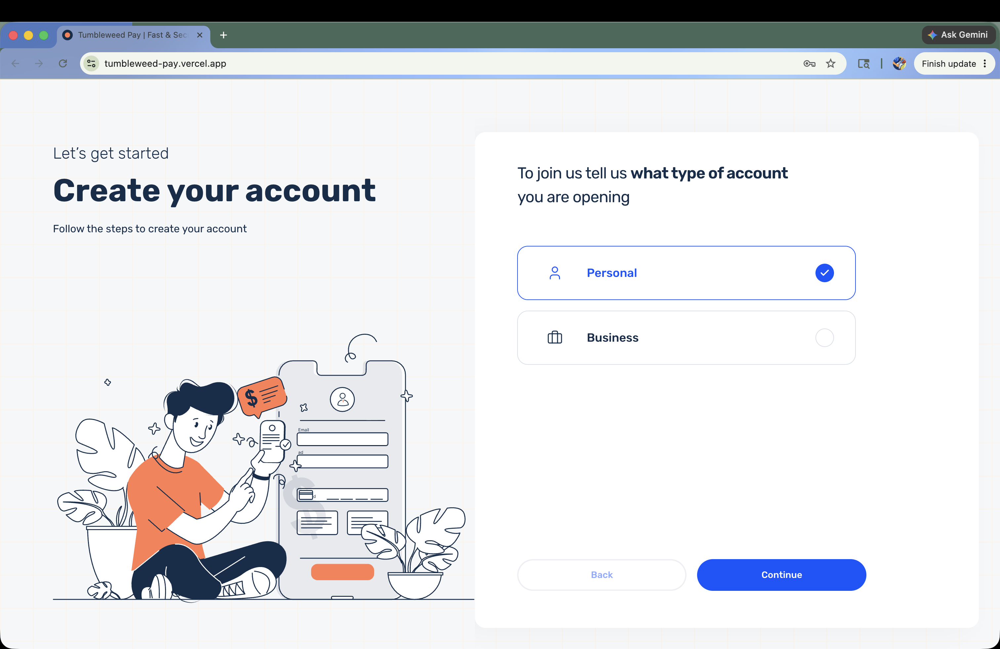
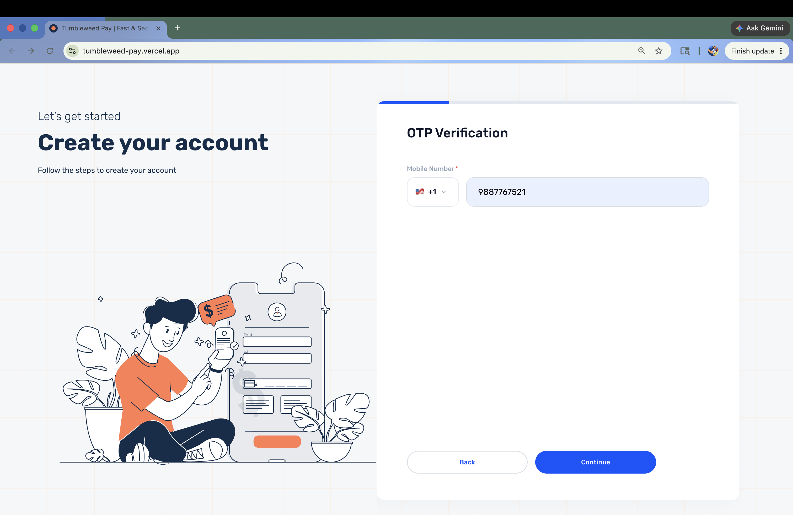
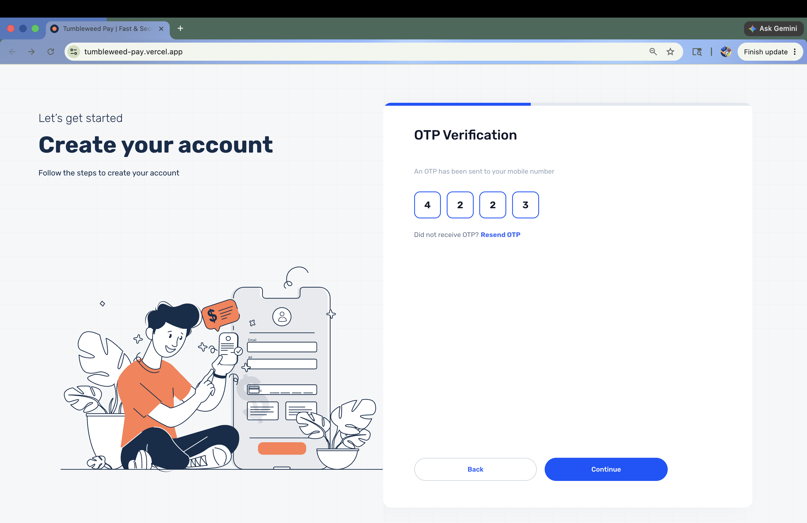
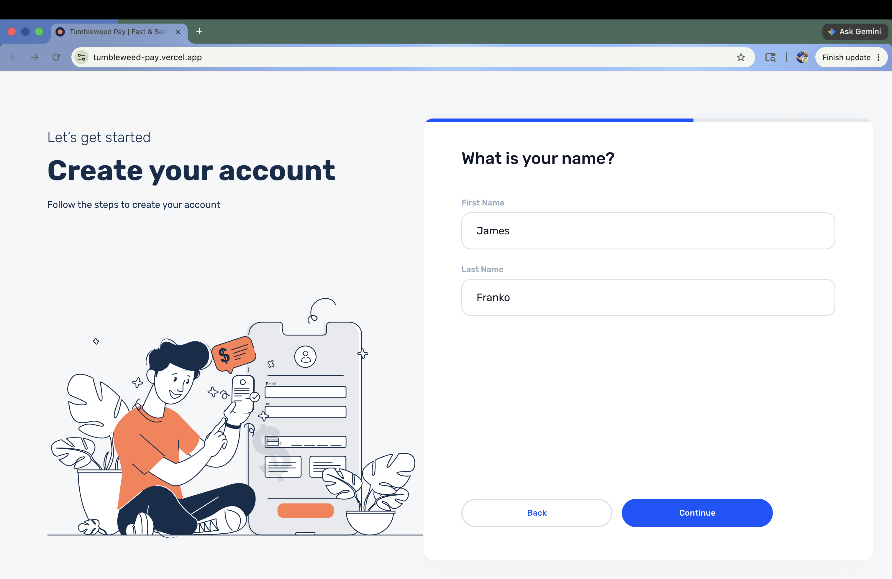
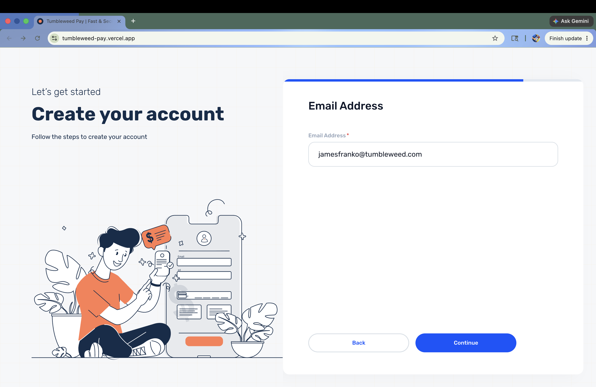
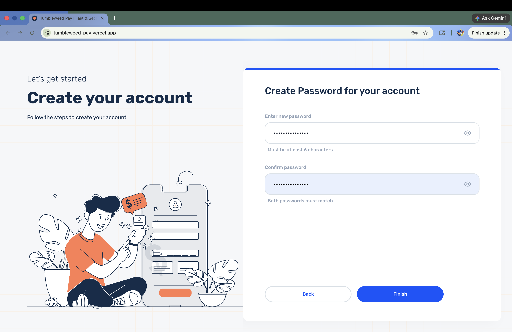
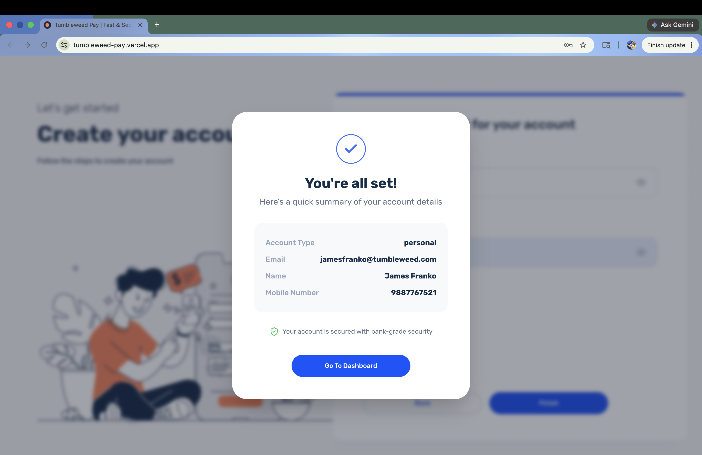
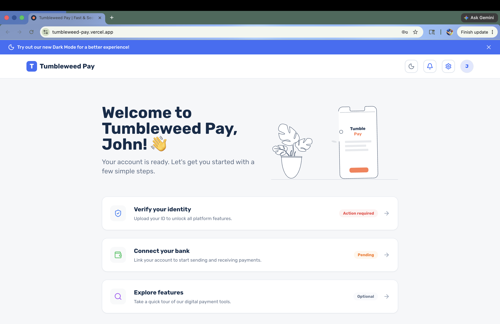

# Tumbleweed Pay - Registration Flow

### Production Lighthouse Scores (Vercel)
<p align="left">
  
  
  
  
</p>

A production-grade, multi-step registration flow built with React 18, TypeScript, and Tailwind CSS. This project follows a strictly organized and type-safe architecture designed for learnability, scalability, and an optimal user experience.

<br />


## ⚡ Production Lighthouse Audit Scores (Vercel)

Tumbleweed Pay is highly optimized for performance, accessibility, best practices, and search engine discoverability. Below are the metrics captured from our latest Lighthouse audit:

| Category | Score | Status |
| :--- | :---: | :--- |
| **⚡ Performance** | **98%** | Green / Excellent |
| **♿ Accessibility** | **90%** | Green / Highly Accessible |
| **🔒 Best Practices** | **100%** | Perfect score |
| **🔍 SEO** | **100%** | Perfect score |

### Core Web Vitals & Metrics:
- **First Contentful Paint (FCP):** `0.7s` (Excellent)
- **Largest Contentful Paint (LCP):** `1.0s` (Excellent)
- **Speed Index:** `0.8s` (Excellent)
- **Total Blocking Time (TBT):** `0ms` (Perfect)
- **Cumulative Layout Shift (CLS):** `0` (Perfect)

<br />

## 🖥 Onboarding Flow Preview

A visual walkthrough of the step-by-step registration flow and the final dashboard UI:

### Step 1: Account Type Selection
<p align="center">
  
</p>

### Step 2: Mobile Number Input
<p align="center">
  
</p>

### Step 3: OTP Code Verification
<p align="center">
  
</p>

### Step 4: Personal Details (Name)
<p align="center">
  
</p>

### Step 5: Email Configuration
<p align="center">
  
</p>

### Step 6: Secure Password Creation
<p align="center">
  
</p>

### Step 7: Account Summary & Review (Success Page)
<p align="center">
  
</p>

### Step 8: Welcome & Dashboard Overview
<p align="center">
  
</p>

---

## 🏗 Architecture & Design Decisions

The codebase is structured around maintaining a strict separation of concerns, ensuring UI components remain "dumb" while business logic is neatly encapsulated in custom hooks and a global store.

### 1. State Management (Zustand)
**Decision:** Zustand over Redux or React Context.
**Rationale:** A multi-step registration flow requires persisting form state across multiple isolated views. Zustand provides a lightweight, hook-based API with zero boilerplate, allowing us to maintain a global state without wrapping the app in complex providers or triggering unnecessary re-renders.

### 2. Form Handling & Validation (React Hook Form + Zod)
**Decision:** Uncontrolled components paired with schema validation.
**Rationale:** React Hook Form drastically reduces re-renders by tracking form state at the input level rather than the component level. By integrating Zod, we ensure single-source-of-truth type safety—our validation schemas automatically infer TypeScript types, making the forms robust and predictable.

### 3. Styling & Composition (Tailwind CSS + `cn` utility)
**Decision:** Utility-first CSS with dynamic class merging.
**Rationale:** Tailwind allows for rapid, centralized design system implementation (via `tailwind.config.ts`). To maintain clean code, we use a custom `cn` utility (`clsx` + `tailwind-merge`) that gracefully handles conditional classes and resolves specificity conflicts in our atomic UI primitives.

### 4. Fluid Animations (Framer Motion)
**Decision:** Direction-aware UI transitions.
**Rationale:** To provide a premium, app-like feel, Framer Motion drives the step transitions. Our custom `useMultiStep` hook tracks the user's navigation vector (forward or backward), dynamically sliding screens in from the correct direction.

## 📂 Directory Structure

```text
src/
├── components/
│   ├── layout/       # Shared structural components (StepLayout, ProgressDots)
│   ├── onboarding/   # Individual step screens and their custom form hooks
│   └── ui/           # Atomic, highly reusable UI primitives (Button, FormField)
├── hooks/            # Global custom React hooks (useMultiStep, useOtpTimer)
├── schemas/          # Zod validation schemas for every form step
├── store/            # Zustand state management (registrationStore, themeStore)
├── types/            # Shared TypeScript interfaces
└── utils/            # Generic helper functions (cn)
```

## 🚀 Potential Enhancements

While the current implementation is highly functional and robust, future iterations could introduce:
- **Backend Integration:** Replace the mocked success state with real API endpoints, implementing proper error handling and retry logic for network requests.
- **Internationalization (i18n):** Abstract hardcoded strings into a localization library (like `react-i18next`) to support multiple languages and regions dynamically.
- **Advanced Accessibility (a11y):** Enhance screen reader support by adding ARIA live regions to announce step transitions and granular error state focus management.
- **Telemetry & Funnel Analytics:** Instrument key actions (step completion, drop-offs, validation errors) to gather data on the onboarding funnel performance.

## 🛠 Development

### Setup
```bash
npm install
```

### Development Server
```bash
npm run dev
```

### Production Build
```bash
npm run build
```

## 📖 Learnable Patterns

- **Barrel Exports**: Every directory contains an `index.ts` file, allowing for clean, consolidated imports (e.g., `import { Button, FormField } from '../ui'`).
- **Hook-Driven Forms**: Each onboarding step pairs its UI component with a custom hook (e.g., `useAccountTypeForm.ts`). This keeps the `.tsx` files focused purely on presentation.
- **Atomic UI**: Complex screens are built by composing simple, single-responsibility UI components, ensuring visual consistency and easy maintenance across the app.
